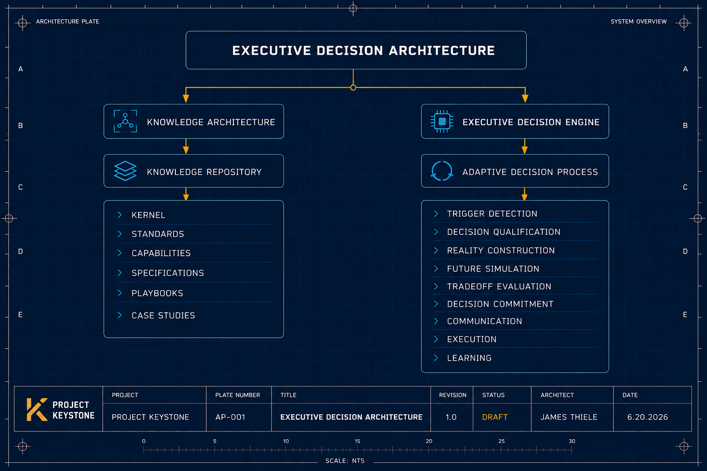

  

---
title: Project Keystone README
document_type: Repository Overview
project: Project Keystone
version: 0.1.0
status: Active
owner: JET
date_created: 2026-06-20
last_modified: 2026-06-21
---

# Project Keystone

> *"Innovation creates possibility. Monetization creates durability."*
> 
> *"Keystone exists to improve real executive decisions. If a feature, framework, or document does not measurably improve a decision currently being made, it waits."*

## Overview

**Project Keystone** is a long-term executive knowledge project focused on Enterprise AI Monetization.

Its mission is to develop a practical, executive-level methodology for understanding and designing monetization strategies for modern enterprise software platforms, using ServiceNow as the primary case study.

While the project originated as preparation for a Director of Monetization Strategy opportunity, it has evolved into a broader body of work focused on commercial strategy, pricing, packaging, AI economics, workflow monetization, and executive decision-making.

Project Keystone is intended to become a living body of intellectual property rather than a static collection of notes.

---

## Mission

Build the definitive executive methodology for Enterprise AI Monetization.

The objective is not simply to prepare for interviews.

The objective is to create durable strategic thinking that helps executives convert innovation into sustainable enterprise value.

---

## Objectives

Project Keystone is designed to:

- Develop a first-principles understanding of Enterprise AI Monetization
- Build reusable executive frameworks for pricing and commercial strategy
- Create an Executive Playbook that teaches AI monetization from foundational concepts through executive strategy
- Produce practical executive decision-support tools, including scorecards, matrices, competitive analyses, and strategic planning models
- Capture original strategic thinking that remains valuable beyond any single company, technology, or market cycle

---

## Primary Deliverables

Project Keystone consists of four interconnected products.

### Executive Playbook

A structured guide that teaches Enterprise AI Monetization from foundational principles through executive strategy.

### Executive Framework Library

A collection of original strategic frameworks, mental models, and executive decision tools.

### Executive Workbook

A companion analytical toolkit containing competitive matrices, pricing comparisons, scorecards, dashboards, planning models, and decision support assets.

### Executive Interview & Thought Leadership Toolkit

Executive talking points, presentation materials, white papers, interview preparation, and future thought leadership derived from the broader methodology.

---

## Guiding Philosophy

Project Keystone is built upon several foundational beliefs.

- Enterprise AI changes how software creates value.
- Monetization is the bridge between innovation and sustainable growth.
- Great pricing balances customer value, adoption, profitability, and long-term platform strength.
- Original frameworks create greater long-term value than summaries of existing research.
- Durable strategic thinking outlasts individual technologies, vendors, and market cycles.

---

## Repository Organization

Project Keystone is organized around a small number of core specification documents supported by frameworks, research, workbook assets, and playbook chapters.

The repository architecture emphasizes clarity, maintainability, version control, and long-term evolution.

---

## Getting Started

To understand or continue Project Keystone, read these documents in order:

1. `start_here.md` — onboarding and current repository contents
2. `00_project_charter.md` (PK-001) — the constitutional baseline
3. `std_000_repository_artifact_classification_standard.md` — artifact taxonomy
4. `std_001_metadata_standard.md` — metadata schema
5. `std_002_repository_change_management_standard.md` — versioning and status lifecycle
6. `std_003_repository_contribution_standard.md` — contribution workflow

A `PROJECT_STATUS.md` and `CHANGELOG.md` will be added once that need has shown up more than
once, per the Repository Growth Rule — they do not exist yet.

---

## Current Status

Project Keystone is currently in its **Foundation Architecture** phase.

Current priorities include:

- Repository architecture
- Project specifications
- Executive Playbook
- Framework Library

Future milestones include:

- Executive Workbook
- Visual Framework Library
- Thought Leadership Edition
- Version 1.0 Release

---

## Architecture Philosophy

Project Keystone follows an **Architecture First** methodology.

The project's structure, standards, governance, and specifications are defined before significant content is created.

This approach promotes consistency, maintainability, and long-term scalability while ensuring that every artifact contributes to a coherent executive knowledge system.

Each specification has a single, well-defined responsibility.

Together, the specifications form the operating system for Project Keystone.

---

## Repository Status

Project Keystone is an active, evolving body of executive research and original strategic thinking.

The repository follows an iterative release model.

Major milestones, architectural decisions, and significant changes will be documented in a future CHANGELOG.md once that file is warranted under the Repository Growth Rule.
